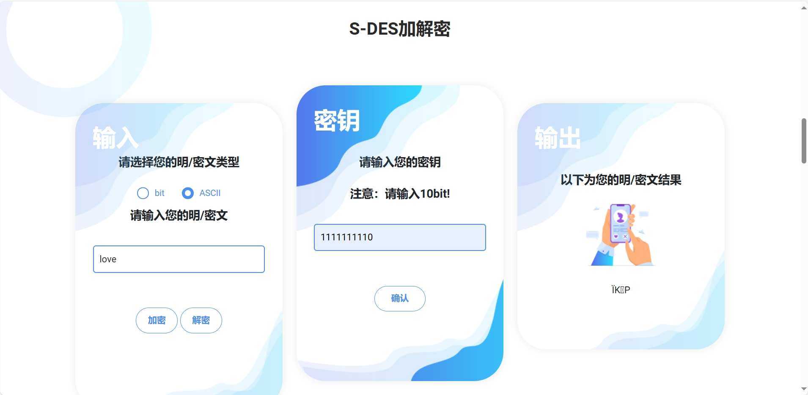
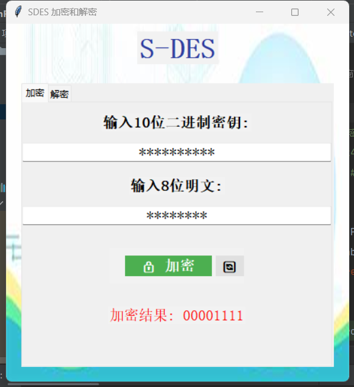
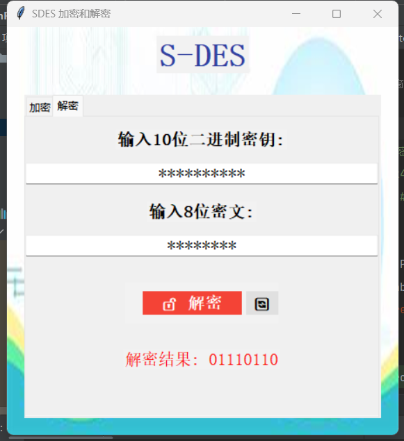
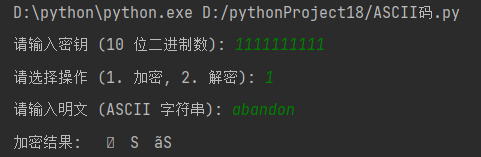
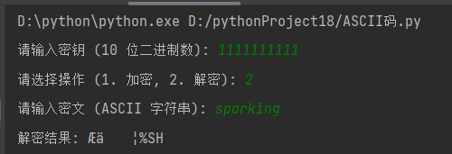
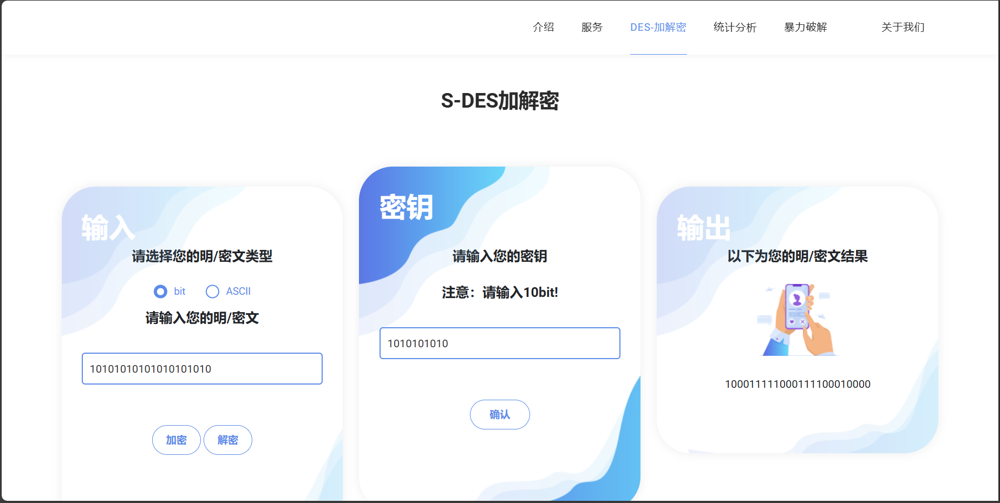
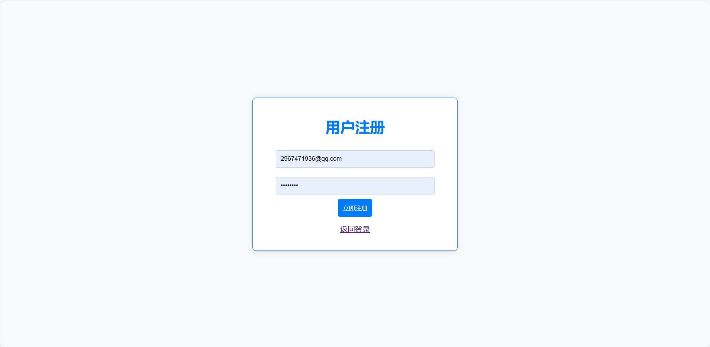
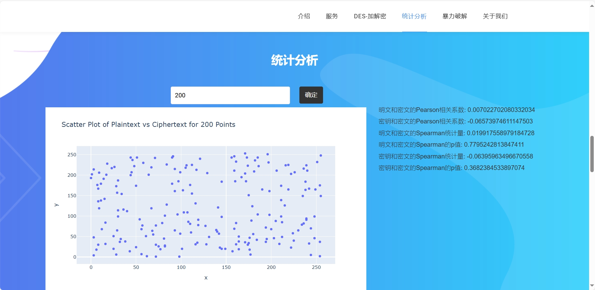

 


> 目录
- [关卡测试报告【共5关】](#关卡测试报告共5关)
  - [第一关-基本测试](#第一关-基本测试)
  - [第二关-交叉测试](#第二关-交叉测试)
  - [第三关-扩展功能](#第三关-扩展功能)
  - [第四关-暴力破解](#第四关-暴力破解)
  - [第五关-封闭测试](#第五关-封闭测试)
- [算法统计分析](#算法统计分析)
  - [相关分析(扩散与混淆)](#相关分析扩散与混淆)
    - [可视化](#可视化)
    - [Pearson与Spearman分析](#pearson与spearman分析)
  - [雪崩效应分析](#雪崩效应分析)
    - [定义](#定义)
    - [测试结果](#测试结果)
    - [分析](#分析)
- [开发手册](#开发手册)
  - [概述](#概述)
  - [环境配置](#环境配置)
  - [安装步骤](#安装步骤)
  - [代码结构](#代码结构)
  - [模块说明](#模块说明)
    - [算法部分](#算法部分)
    - [前后端部分](#前后端部分)
- [用户指南](#用户指南)
- [常见问题](#常见问题)

# 关卡测试报告【共5关】

## 第一关-基本测试

针对明文和密文，有 Bit 和 ASCII 两种不同的输入类型，分别进行标准输入测试和非法输入测试，测试情况如下：

- **标准输入一**：8bit 的明文或密文，10bit 的密钥，加密结果如下  
  

- **标准输入二**：8bit 的明文或密文，10bit 的密钥，解密结果如下  
  

- **标准输入三**：ASCII 类型的明文或密文，10bit 的密钥，加密结果如下  
  

- **标准输入四**：ASCII 类型的明文或密文，10bit 的密钥，解密结果如下  
  

- **特殊输入一**：密钥输入位数不正确，提示用户输入正确的密钥格式  
  

- **特殊输入二**：密钥输入格式不是 bit，或当选中明密文输入类型为 Bit 时，输入的不是 Bit 类型数据，提示用户输入正确的格式  
  

## 第二关-交叉测试
### 加密
- **明文**: `11111111`
- **密钥**: `1111111111`

- **我们组测试情况**：
  

- **石子伯组测试情况**：
  
  

如图所示, 测试通过。

  ### 解密
- **密文**: `11111110`
- **密钥**: `1111111111`

- **我们组测试情况**：
  

- **石子伯组测试情况**：
  
  

如图所示, 测试通过。

## 第三关-扩展功能
### ASCLL加密
- **明文**: `abandon`  
- **密钥**: `1111111111`

- **我们组测试情况**：
  

- **石子伯组测试情况**：
  
  

如图所示, 测试通过。

### ASCLL解密
- **密文**: `sparking`
- **密钥**: `1111111111`

- **我们组测试情况**：
  

- **石子伯组测试情况**：
  
  

如图所示, 测试通过。

  
### 不限位数及位数填充
- **明文**: `10101010101010101010` 
- **密钥**: `1010101010`

- **测试情况**：
  

- **密文**: `10101010101010101010` 
- **密钥**: `1010101010`
  
- **测试情况**：
  

如图所示, 测试通过。

## 第四关-暴力破解

### 任务描述
采用遍历的方式，尝试将所有可能的密钥（**0** 到 **1023**），对每一个密钥进行加密，生成密文。将生成的密文与已知的密文进行比对。如果匹配，则记录下该密钥。在界面上显示出找到的密钥和破解需要的时间。

### 具体界面

## 第五关-封闭测试
### 明密文对的密钥唯一性探究

针对一对明密文对，我们探究是否有多个密钥。在第四关暴力破解中，我们在密钥空间搜索可能的密钥，并将找到的密钥全部输出。我们调用本小组编写的 `StatisticalAnalysis` 类的暴力破解函数 `bruteForceAttack`，进行密钥空间搜索。

```python
print("暴力破解 ------------------------------------------------------")
SA = StatisticalAnalysis()
plainText = np.array([1, 1, 1, 0, 0, 0, 0, 0])
cipherText = np.array([1, 1, 1, 1, 0, 1, 1, 0])
SA.bruteForceAttack(plainText, cipherText)
```

输出的结果如下：

```
暴力破解 ------------------------------------------------------
暴力解出的密钥1是: [0 0 0 0 1 1 0 0 1 0]
暴力解出的密钥2是: [0 0 1 1 0 0 1 0 1 0]
暴力解出的密钥3是: [0 1 0 0 1 1 0 0 1 0]
暴力解出的密钥4是: [0 1 1 1 0 0 1 0 1 0]
```

结果说明明密文对所对应的密钥不具有唯一性，随机选择的一个明密文对不止一个密钥Key。

### 加密碰撞探究

加密碰撞探究是指探究对应明文空间任意给定的明文分组，是否会出现选择不同的密钥加密得到相同密文的情况。我们调用本小组编写的 `StatisticalAnalysis` 类的碰撞检测函数 `foundCollision`，用所有密钥对同一个明文进行加密，查看所对应的密文是否会出现重复：

```python
print("寻找碰撞 ------------------------------------------------------")
SA = StatisticalAnalysis()
plainText = np.array([1, 1, 1, 0, 0, 0, 0, 0])  # 固定明文
collision_result = SA.foundCollision(plainText)
```

输出如下（由于输出过长，这里只展示部分输出）

```
寻找碰撞 ------------------------------------------------------
密文: 11101110 对应的多个密钥 -> [array([0, 0, 0, 0, 0, 0, 0, 0, 0, 0]), array([0, 1, 0, 0, 0, 0, 0, 0, 0, 0])]
密文: 01101111 对应的多个密钥 -> [array([0, 0, 0, 0, 0, 0, 0, 0, 0, 1]), array([0, 1, 0, 0, 0, 0, 0, 0, 0, 1])]
密文: 01011010 对应的多个密钥 -> [array([0, 0, 0, 0, 0, 0, 0, 0, 1, 0]), array([0, 0, 1, 1, 1, 1, 1, 0, 1, 1]), array([0, 1, 0, 0, 0, 0, 0, 0, 1, 0]), array([0, 1, 1, 1, 1, 1, 1, 0, 1, 1]), array([1, 0, 0, 1, 1, 0, 1, 1, 0, 1]), array([1, 1, 0, 1, 1, 0, 1, 1, 0, 1])]
密文: 00111011 对应的多个密钥 -> [array([0, 0, 0, 0, 0, 0, 0, 0, 1, 1]), array([0, 1, 0, 0, 0, 0, 0, 0, 1, 1]), array([1, 0, 0, 0, 0, 1, 0, 1, 0, 1]), array([1, 0, 1, 1, 1, 0, 1, 1, 0, 0]), array([1, 1, 0, 0, 0, 1, 0, 1, 0, 1]), array([1, 1, 1, 1, 1, 0, 1, 1, 0, 0])]

...

密文: 00100101 对应的多个密钥 -> [array([1, 0, 1, 1, 1, 0, 0, 0, 0, 1]), array([1, 1, 1, 1, 1, 0, 0, 0, 0, 1])]
密文: 01000001 对应的多个密钥 -> [array([1, 0, 1, 1, 1, 1, 0, 1, 0, 1]), array([1, 1, 1, 1, 1, 1, 0, 1, 0, 1])]
```

因此，加密碰撞的情况是存在的，也就是对于固定明文，可能由不同的密钥加密出相同的明文。


# 算法统计分析
## 相关分析(扩散与混淆)
### 可视化
我们使用`StatisticalAnalysis`类的数据组生成函数生成`10000`组明文-密钥-密文
```python
SA = StatisticalAnalysis()
plainText_decimal, cipherText_decimal, key_decimal = SA.generateGroup(10000)
```
为了便于可视化，研究相互关系的统计规律，我们将明文、密钥和密文由二进制串转为十进制数。我们将明文-密文对、密钥-密文对绘制成散点图，其中散点的颜色值代表明文与密文或者密钥与密文的相似度。可视化结果如下图所示。

如图，我们可以看到明文-密文对、密钥-密文对分布的很均匀，说明扩散和混淆在破坏了统计规律方面上表现较好。
### Pearson与Spearman分析
散点图只能粗略看出SDES算法的效果，为了量化效果，我们做了`Pearson`与`Spearman`分析，结果如下图所示:

1. 明文-密文相关性分析。Pearson 相关系数为`0.0021`，接近于零，表示在数值线性关系上，明文和密文几乎没有直接的线性相关性。
Spearman 统计量为`0.0020`，同样接近于零，说明在秩次相关性（即排序上的关系）方面，明文和密文也没有显著的相关性。Spearman统计量的p值为`0.91`，显著拒绝明文和密文具有相关性的原假设。
这种低相关性表明加密算法很好地打破了明文和密文之间的统计规律，实现了“扩散”的效果。
2. 密钥-密文相关性分析。Pearson相关系数为`-0.0142`，接近零，表示密钥和密文在数值上的线性相关性也极低。Spearman 统计量为`-0.0145`，同样表明在秩次相关性上，密钥和密文没有明显的关联。
Spearman统计量的p值为`0.094`，显著拒绝明文和密文具有相关性的原假设。这种结果表明加密算法实现了“混淆”效果，密钥的变化不会与密文的具体内容产生直接的关联。
## 雪崩效应分析
为了进一步探究 S-DES 算法的效能，我们进行了雪崩效应测试，分析其扩散性(Diffusion)和混淆性(Confusion)。雪崩效应指的是加密算法在明文或密钥发生微小变化时，密文输出会有较大的变化。
### 定义
- **扩散性（Diffusion）**：如果明文输入发生微小变化，密文输出应有显著差异。即当明文的某一位改变时，密文的差异位数超过总位数的一半，我们认为输出发生了截然不同的变化。
- **混淆性（Confusion）**：类似地，如果密钥输入发生微小变化，密文输出应有显著差异。即密钥的某一位发生改变时，密文的变化应超过一半位数。
### 测试结果
测试结果如下图所示：


- **扩散效应比例**（明文）：经过 100 组明文的测试，扩散效应的比例为 **25.5%**，即当明文发生一位变化时，只有 25.5% 的密文位发生了超过一半的变化。
- **混淆效应比例**（密钥）：在密钥的雪崩效应测试中，混淆效应的比例为 **13.1%**，即当密钥发生一位变化时，只有 13.1% 的密文位发生了超过一半的变化。
### 分析
- **扩散效应**（明文）：尽管存在一定的扩散效应，但 **25.5%** 的比例表明算法在处理明文扩散时效果不佳，理想情况下应达到 **50%** 的密文位变化。
- **混淆效应**（密钥）：**13.1%** 的混淆效应比例更低，说明密钥的微小变化对密文的影响有限，混淆效果不理想。
当前S-DES算法的扩散和混淆效应表现都较差，距离理想的 **50%** 雪崩效应还有较大提升空间。

总而言之，我们认为雪崩效应效果较差的原因是**S-DES算法结构过于简单，加密轮数过少**。

# 开发手册
## 概述
本手册提供了关于 S-DES 加密算法及其实现的详细说明和使用指南。该算法用于对8位明文和10位密钥进行加密/解密，具有简单、轻量化的特性，适用于教学和小型项目的加密需求。
## 环境配置
- 操作系统：Windows
- 编程语言：Python 3.8+
- 依赖库：
  - `numpy`: 处理矩阵运算
  - `matplotlib`: 进行数据可视化
  - `scipy`: 进行统计分析
## 安装步骤
1. 克隆项目代码：
   ```bash
   git clone https://github.com/CoffeeTau/DSG_S-DES_2024.git
   ```
2. 进入项目目录，安装依赖：
   ```bash
   cd DSG_S-DES_2024
   pip install -r requirements.txt
   ```
## 代码结构
项目代码结构如下:

```
├── .git
├── .idea
├── app.py
├── Function_f.py
├── images
├── IP.py
├── loginSQL.py
├── plaintext_key_ciphertext.csv
├── README.md
├── requirements.txt
├── SDES.py
├── static
├── StatisticalAnalysis.py
├── SubKeyGenerator.py
├── SW.py
├── templates
│   ├── error.html
│   ├── index.html
│   ├── system.html
│   └── user-register.html
├── tree.py
├── utils.py
└── __pycache__
```

## 模块说明
### 算法部分
#### f 函数
**`f`** 函数由类 **`Function_f`** 实现，主要实现 SDES 算法中的轮函数操作。类中定义了 2 个 P 盒和 2 个 S 盒，成员函数功能如下：

- **`expandBlock`**：将输入经过 P 盒Ⅰ的 4 位扩展为 8 位。
- **`sBoxSubstitution`**：将输入经过 S 盒替换，由 8 位转换为 4 位。
- **`permutationBlock`**：将输入经过 P 盒Ⅱ进行 4 位置换。
- **`round`**：实现一次轮函数计算。
- **`calculate`**：整合所有操作，完成 `f` 函数的整体计算过程。

#### 初始置换IP
初始置换功能由类 **`IP`** 实现。类中定义了初始置换函数 **`initialP`** ，以及逆初始置换函数 **`initialP_Inverse`**。

#### 子密钥生成算法
子密钥生成功能由类 **`SubKeyGenerator`** 实现。类中定义了2个P盒，第一次轮换函数 **`subKeyGenerateShift1`** ，第二次轮换函数 **`subKeyGenerateShift2`** ，以及总子密钥生成函数 **`generate`** 。

#### 交换SW
交换功能由类 **`SW`** 实现。类中定义了交换函数 **`swap`**。

#### SDES算法
SDES算法的集成实现由类 **`SDES`** 完成。**`SDES`** 类实现了 SDES 算法的加密与解密过程，包含以下主要功能：
- **`padString` 和 `unpadString`**：用于对字符串进行填充和去填充，确保数据长度符合 8 位分组的要求。
- **`encryptOrDecrypt`**：根据输入的密钥和操作类型（加密/解密）执行核心算法，包含两轮 `f` 函数计算、交换操作和初始置换。
- **`encryptString` 和 `decryptString`**：将字符串按字节或位操作进行加密和解密，输出最终的密文或明文。

#### 统计分析
**`StatisticalAnalysis`** 类实现了对 SDES 算法的统计分析功能，主要包括明文、密钥和密文的生成、相关性分析、雪崩效应检验、暴力破解测试以及寻找碰撞等。类中的主要成员函数和功能如下：

- **`generateGroup(num)`**: 
  - 生成指定数量的明文、密钥和密文组合，并保存至 CSV 文件。
  - 返回转换为十进制的明文、密钥和密文数组。

- **`correlationAnalysis(pair, type)`**: 
  - 计算明文-密文 (P-C) 或密钥-密文 (K-C) 之间的相关性。
  - 支持 Pearson 和 Spearman 两种相关性分析方法。

- **`avalancheTest()`**: 
  - 检验明文和密钥微小变化引起的雪崩效应 (Diffusion 和 Confusion)。
  - 通过统计微小变化导致的密文输出差异比例来评估雪崩效应。

- **`bruteForceAttack(plainText, cipherText)`**: 
  - 对给定的明文和密文进行暴力破解。
  - 返回暴力破解所需的时间以及可能的密钥列表。

- **`foundCollision(plainText)`**: 
  - 寻找与给定明文对应的多个密钥产生相同密文的情况。
  - 输出所有密文与密钥碰撞的情况。

#### 工具utils
- **`sbox_index(block, axis)`**: 
  - 输入一个二进制块 `block` 和指定的轴（'x' 或 'y'）。
  - 计算并返回置换盒元素在指定轴上的索引。
  - 根据输入的轴选择相应的比特位进行转换。

- **`convert_to_np_array(column)`**: 
  - 接收一个列数据，检查其元素类型，并将包含二进制字符串的元素转换为 NumPy 数组。
  - 返回一个 NumPy 数组，其中所有二进制字符串均被转换为 NumPy 数组。

- **`convert_to_decimal(binary_arr)`**: 
  - 将二进制字符串数组转换为十进制整数。
  - 验证输入的二进制字符串是否有效，如果无效，则引发 `ValueError`。
  - 返回一个包含对应十进制整数的 NumPy 数组。

- **`np10ToDecimal(block)`**: 
  - 接收长度为 10 的二进制 NumPy 数组 `block`。
  - 将其转换为十进制整数并返回。

- **`decimalToNp10(decimal_value)`**: 
  - 将给定的十进制数 `decimal_value` 转换为 10 位二进制字符串。
  - 如果转换后的二进制数少于 10 位，则在左侧用 0 填充。
  - 返回一个 NumPy 数组，元素为 0 和 1。


### 前后端部分

#### 前端说明

前端使用 HTML、JavaScript 和 CSS 构建用户友好的界面，允许用户进行加解密操作及统计分析，功能包括：

- **服务展示**：
  - 介绍 SDES 算法功能，动态展示每项服务的详细内容。

- **用户输入区域**：
  - 选择加密或解密，输入明文或密文及密钥，实时反馈数据有效性。
  
- **统计分析功能**：
  - 输入明文数量进行统计分析，展示生成的 scatter 图及相关统计结果，如 Pearson 和 Spearman 相关性。
  
- **暴力破解功能**：
  - 用户输入8位二进制的明文和密文，通过按钮触发 `mybruteForce` 函数，向后端发送请求，返回破解所需时间和得到的密钥。
  
- **与后端交互**：
  - 使用 fetch API 实现与 Flask 后端交互，动态更新响应信息，提供友好体验。

#### 后端说明

后端使用 Flask 框架实现 SDES 算法的加解密、统计分析及暴力破解功能，包括：

- **路由设置**：
  - 定义不同路由，如 `/encrypt`、`/decrypt`、`/generate-scatter` 和 `/brute-force`，处理相应请求。
  
- **加解密功能**：
  - 接收前端数据，调用 `encryptOrDecrypt` 方法进行加密或解密，并返回结果。
  
- **统计分析功能**：
  - 实现 `StatisticalAnalysis` 类功能，接受前端请求并返回生成的统计结果，包括相关性分析、雪崩效应检验等。
  
- **暴力破解功能**：
  - 接收前端输入的明文和密文，确保格式为8位二进制数。
  - 调用 `bruteForce` 方法，尝试通过暴力方式找出对应的密钥。
  - 返回破解所需的时间和得到的密钥，供前端展示。
  
- **数据格式处理**：
  - 解析前端数据，将明文、密钥和密文转换为必要格式，结果以 JSON 格式返回前端。


# 用户指南

欢迎使用 S-DES 加密算法工具！本指南将帮助您理解如何使用该工具进行加解密、统计分析、暴力破解等功能。

## 1. 登录与注册

### 1.1 登录
1. 打开网页，您将首先看到登录界面。
2. 输入您的用户名和密码。
3. 点击“登录”按钮。
4. 如果凭证正确，系统将进入主界面；否则，将显示错误消息。
   

### 1.2 注册
1. 在登录界面，点击“注册”按钮。
2. 输入所需的注册信息，如用户名、密码等。
3. 点击“提交”按钮。
4. 注册成功后，您可以使用新账户登录。
   

## 2. 项目介绍
S-DES（Simplified Data Encryption Standard）是一种简化的对称加密算法，旨在提供数据安全性。该工具允许用户进行加密和解密操作，进行统计分析，并支持暴力破解。


## 3. 服务展示
该部分介绍 S-DES 算法的主要功能，包括：
- 数据加密和解密
- 统计分析
- 暴力破解


## 4. S-DES 加解密

### 4.1 加密
1. 在用户输入区域选择“加密”。
2. 输入8位明文（以二进制或 ASCII 格式）和10位密钥。
3. 点击“加密”按钮。
4. 系统将返回加密后的密文，显示在反馈区域。

### 4.2 解密
1. 在用户输入区域选择“解密”。
2. 输入8位密文（以二进制或 ASCII 格式）和10位密钥。
3. 点击“解密”按钮。
4. 系统将返回解密后的明文，显示在反馈区域。


## 5. 统计分析
1. 在统计分析功能区域输入要生成的明文数量。
2. 点击“确定”按钮。
3. 系统将展示散点图及相关统计结果，如 Pearson 和 Spearman 相关性。


## 6. 暴力破解
1. 在暴力破解功能区域输入8位二进制的明文和密文。
2. 点击“破解”按钮。
3. 系统将进行暴力破解，返回找到的密钥和破解所需的时间，显示在输出区域。


## 7. 关于我们
我们是一个致力于数据安全和加密技术的团队，旨在提供简洁易用的加密工具，以帮助用户保护他们的数据隐私。欢迎随时与我们联系，获取更多信息。


# 常见问题

## 1. **什么是 SDES 算法？**
   SDES（简易数据加密标准）是一种对称加密算法，使用 10 位密钥和 8 位明文，通过多个置换和替换步骤将明文转换为密文。

## 2. **如何生成明文、密钥和密文组？**
   可以使用 `generateGroup(num)` 函数生成指定数量的明文、密钥和密文组。该函数会生成随机的明文和密钥，并通过 SDES 算法加密生成相应的密文。

## 3. **如何进行相关性分析？**
   使用 `correlationAnalysis(pair, type)` 函数可以分析明文与密文、密钥与密文之间的相关性。可以选择使用 Pearson 或 Spearman 方法来计算相关系数。

## 4. **什么是雪崩效应？**
   雪崩效应指的是在加密过程中，输入的微小变化会导致输出发生显著变化。使用 `avalancheTest()` 函数可以验证明文和密钥的微小变化是否导致密文的明显变化。

## 5. **如何进行暴力破解？**
   使用 `bruteForceAttack(plainText, cipherText)` 函数可以对给定的明文和密文进行暴力破解。该函数会遍历所有可能的密钥，并记录找到的匹配密钥及所需时间。
