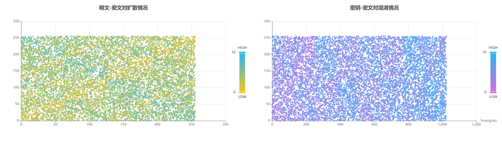
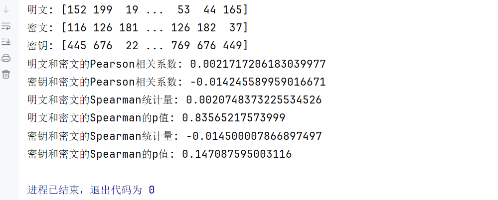

 


# 关卡测试报告【共5关】
## 第一关-基本测试

## 第二关-交叉测试

## 第三关-扩展功能

## 第四关-暴力破解

## 第五关-封闭测试

# 算法统计分析
## 相关分析(扩散与混淆)
### 可视化
我们使用StatisticalAnalysis类的数据组生成函数生成10000组明文-密钥-密文
```python
SA = StatisticalAnalysis()
plainText_decimal, cipherText_decimal, key_decimal = SA.generateGroup(10000)
```
为了便于可视化，研究相互关系的统计规律，我们将明文、密钥和密文由二进制串转为十进制数。我们将明文-密文对、密钥-密文对绘制成散点图，其中散点的颜色值代表明文与密文或者密钥与密文的相似度。可视化结果如下图所示。

如图，我们可以看到明文-密文对、密钥-密文对分布的很均匀，说明扩散和混淆效果较好，破坏了统计规律。
### Pearson与Spearman分析
散点图只能粗略看出SDES算法的效果，为了量化效果，我们做了Pearson与Spearman分析。



## 雪崩效应分析

# 开发手册

# 用户指南

# 常见问题

